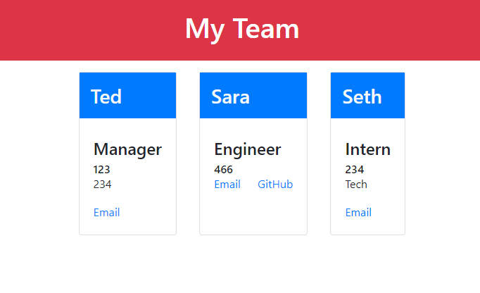

## Team Profile Generator
# Description

The team profile generator is a command-line application that prompts users for their team members and information and creates an HTML file which displays this information. This includes names, email addresses, GitHub profiles, employee IDs, and office locations. After entering the team managers information, users are prompted to provide different information for engineers and interns on the team. Below is a list of require info for each individual.
# Manager
- Name
- ID
- Email
- Office
# Engineer
- Name
- ID
- Email
- GitHub
# Intern
- Name
- ID
- Email
- School

[Team Profile Generator](https://matthale11.github.io/team-profile-generator/)

